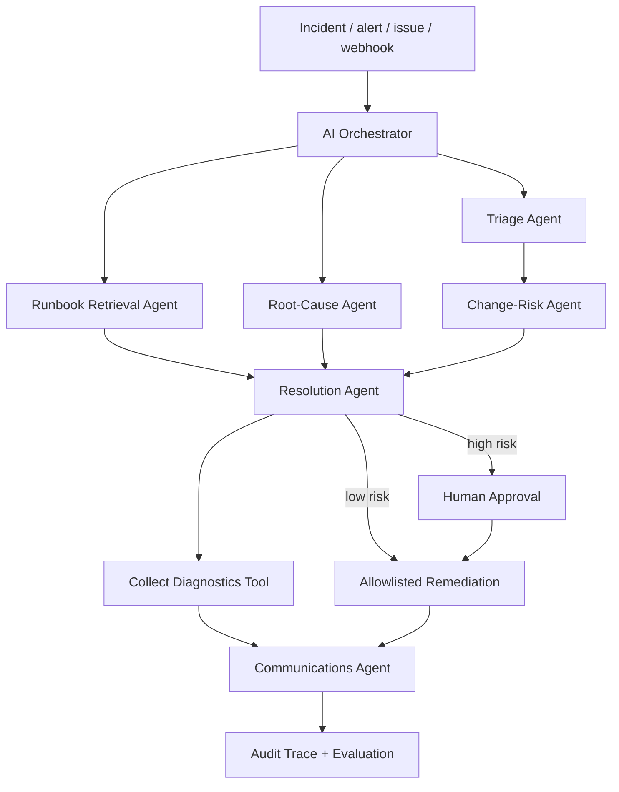

# AutonomousOps — AI Incident Response & Service Recovery Agent

**Event-driven agentic AI orchestration for incident triage, grounded runbook retrieval, governed tool use, human approval and stakeholder communication.**

[](https://github.com/Samadritaacharya/autonomousops-incident-response-agent/actions/workflows/ci.yml)
[](https://github.com/Samadritaacharya/autonomousops-incident-response-agent/actions/workflows/frontend-ci.yml)
[](https://github.com/Samadritaacharya/autonomousops-incident-response-agent/actions/workflows/incident-agent-demo.yml)

> **Portfolio-safe by design:** all datasets are synthetic and all infrastructure mutations are simulated. The project demonstrates orchestration, tool selection and governance without touching a real production environment.

## Interactive Command Center

The repository now includes a modern **Next.js 16 / React 19 command center** in [`frontend/`](frontend/). It is a zero-required-paid-service recruiter experience with a live incident simulator, human approval/rejection path, complete agent/tool trace, React Three Fiber orchestration graph, ShaderGradient motion, reproducible evaluation metrics and local-only run history.

The public web runtime intentionally requires **no model key, database, login, telemetry service or paid API**. Its deterministic TypeScript engine mirrors the Python governance contract, while the existing Python implementation remains the canonical full backend and optional generative-reasoning implementation.

Run it locally:

```bash
cd frontend
npm install
npm run dev
```

For a public demo, Vercel can use `frontend` as the Root Directory. Vercel Hobby is a free hosting option within its published quotas; the app itself is not coupled to Vercel and runs on any compatible Node host. See [`frontend/README.md`](frontend/README.md), [`frontend/DESIGN.md`](frontend/DESIGN.md) and [`docs/web-command-center.md`](docs/web-command-center.md).

## Verified end-to-end proof

AutonomousOps has been exercised through a real GitHub event path, not just a local function call:

1. A synthetic `[INCIDENT]` issue triggered GitHub Actions.
2. The agent classified the checkout outage as **P1**, grounded on `api-latency.md`, collected diagnostics and paused at the approval gate.
3. An authorized `/approve` issue comment resumed the workflow.
4. The allowlisted **scale worker** simulation executed successfully and GitHub Actions posted the final stakeholder/audit response.
5. The demonstration issue was closed as completed.

**Proof run:** [Issue #1 — Checkout API timeouts after deployment](https://github.com/Samadritaacharya/autonomousops-incident-response-agent/issues/1)

## Why I built this

Many AI portfolios stop at chatbots or dashboards. AutonomousOps demonstrates a harder enterprise pattern: an operational event starts the system, specialist agents build context, knowledge grounds the plan, deterministic policy controls risk, tools execute allowed steps, humans approve high-impact actions, stakeholders are updated and the complete run is auditable.

It is designed as an end-to-end demonstration of the skills behind my Microsoft Copilot Studio learning in:

- building an initial agent
- extending agents with tools, connectors and flows
- making agents autonomous with event triggers, conditions, testing and monitoring

## Business workflow



## What is actually working

| Capability | Implementation |
|---|---|
| Interactive web command center | Next.js 16 + React 19 |
| Web 3D / motion layer | React Three Fiber + ShaderGradient + Motion |
| Zero-key hosted demo backend | Next.js route handlers + deterministic TypeScript agent contract |
| Event-driven trigger | GitHub Issues → GitHub Actions |
| Recruiter UI | Next.js command center + Streamlit |
| Machine-to-machine endpoint | FastAPI + Next.js incident route |
| Triage Agent | Severity + SLA classification |
| Runbook Agent | Grounded retrieval from repository knowledge |
| Root-Cause Agent | Optional LLM reasoning with deterministic fallback |
| Risk Agent | Deterministic approval policy |
| Resolution Agent | Grounded allowlisted action selection |
| Tool Executor | Diagnostics + safe remediation simulation |
| Human-in-the-loop | Web UI + Streamlit/API + GitHub `/approve` / `/reject` resume path |
| Communications Agent | Stakeholder-ready incident update |
| AgentOps | Trace IDs, per-agent evidence and JSONL audit log |
| Evaluation | Checked-in test set + pytest + reproducible Python/TypeScript evaluation |
| CI | Python compile/tests/evaluation/UI/API/Docker + web typecheck/tests/build/HTTP smoke |
| Containerization | Docker + docker-compose |
| Copilot Studio mapping | Detailed enterprise implementation blueprint |

## Specialist agents

1. **Triage Agent** — classifies P1-P4 severity and SLA target.
2. **Runbook Retrieval Agent** — selects the most relevant operating procedure.
3. **Root-Cause Agent** — generates bounded hypotheses from incident + runbook context.
4. **Change-Risk Agent** — owns the deterministic approval boundary.
5. **Resolution Agent** — selects an allowlisted candidate action.
6. **Tool Executor** — runs diagnostics and safe remediation simulations.
7. **Communications Agent** — produces the stakeholder update.
8. **Orchestrator** — sequences the workflow and preserves the trace.

### Important governance design

The optional generative model **cannot authorize tools**. Model output can enrich hypotheses, but severity, approval requirements and write-capable tool execution remain deterministic. That prevents a probabilistic model from self-authorizing a production-impacting action.

## Python quick start

```bash
python -m venv .venv
# Windows
.venv\Scripts\activate
# macOS/Linux
source .venv/bin/activate

pip install -r requirements.txt
streamlit run app.py
```

Then open the Streamlit URL shown in your terminal.

### Optional generative reasoning

The repository works without model credentials. To enable the optional Root-Cause Agent LLM layer:

```bash
cp .env.example .env
# add OPENAI_API_KEY to .env
```

The deterministic fallback remains active if no key is present or the model call fails. Severity, approval and tool permissions remain deterministic in both modes.

## Run the API

```bash
uvicorn api:app --reload
```

Health check:

```bash
curl http://127.0.0.1:8000/health
```

Incident event:

```bash
curl -X POST "http://127.0.0.1:8000/v1/incidents" \
  -H "Content-Type: application/json" \
  -d '{
    "incident_id":"INC-API-1",
    "title":"Checkout API timeouts",
    "description":"Production checkout requests are timing out after a deployment",
    "service":"checkout-api",
    "environment":"production",
    "customer_impact":"Multiple customers cannot complete checkout",
    "recent_change":true
  }'
```

## Run with Docker

```bash
cp .env.example .env
docker compose up --build
```

- Streamlit: `http://localhost:8501`
- FastAPI: `http://localhost:8000`
- API docs: `http://localhost:8000/docs`

See [docs/deployment.md](docs/deployment.md) for the Python public deployment path and [docs/web-command-center.md](docs/web-command-center.md) for the zero-key web architecture.

## Autonomous GitHub demo

This is the most recruiter-friendly proof that the project is **event driven rather than chat only**.

1. Open **Issues → New issue**.
2. Choose **AutonomousOps incident demo**.
3. Use a synthetic scenario and submit it.
4. The issue title starts with `[INCIDENT]`, which triggers `.github/workflows/incident-agent-demo.yml`.
5. GitHub Actions runs the complete orchestrator.
6. The agent posts severity, runbook, hypotheses, tool trace, governance evidence and the stakeholder update back to the issue.
7. If the risk gate pauses the workflow, an authorized repository owner/collaborator comments `/approve` to resume the safe simulation or `/reject` to stop it.
8. The resumed workflow posts the final tool execution and stakeholder update back to the issue.

No separate `incident` label is required.

## Evaluation

Python:

```bash
python -m pytest -q
python scripts/evaluate.py
```

Command center:

```bash
cd frontend
npm run typecheck
npm test
npm run build
```

The eight checked-in synthetic cases in `data/sample_incidents.csv` are mirrored by the web evaluation fixtures so the public command center can prove severity, runbook and approval-gate behavior without an external service.

The repository deliberately does **not** hard-code impressive-looking portfolio metrics. Only measured results should be added to a CV or LinkedIn project description.

## Repository structure

```text
.
├── frontend/                       # Next.js interactive command center
│   ├── app/                        # UI + route handlers
│   ├── components/                 # motion, 3D graph, simulator
│   ├── lib/                        # deterministic web agent contract
│   ├── tests/                      # parity + governance tests
│   ├── DESIGN.md
│   └── README.md
├── app.py                          # Streamlit recruiter experience
├── api.py                          # FastAPI event endpoint
├── src/
│   ├── agents.py                   # specialist agents
│   ├── evaluator.py               # measured evaluation
│   ├── llm.py                     # optional generative reasoning
│   ├── models.py                  # incident/trace models
│   ├── orchestrator.py            # multi-agent workflow
│   └── tools.py                   # governed tool layer
├── scripts/
│   ├── evaluate.py                # reproducible evaluation command
│   ├── simulate_incident.py
│   └── github_issue_agent.py
├── knowledge/runbooks/            # grounded operating procedures
├── data/sample_incidents.csv      # evaluation test set
├── docs/
│   ├── architecture.md
│   ├── copilot-studio-implementation.md
│   ├── demo-script.md
│   ├── deployment.md
│   └── web-command-center.md
├── tests/
├── .github/
│   ├── ISSUE_TEMPLATE/incident.yml
│   └── workflows/
├── .streamlit/config.toml
├── Dockerfile
├── docker-compose.yml
├── SECURITY.md
└── LICENSE
```

## Microsoft Copilot Studio enterprise version

See **[docs/copilot-studio-implementation.md](docs/copilot-studio-implementation.md)** for the direct mapping to:

- agent instructions and generative orchestration
- knowledge grounding
- tools / connectors / agent flows
- autonomous event triggers
- Power Automate-style approvals
- incident updates and Teams/Outlook communications
- testing, evaluation and monitoring

The public Python/GitHub implementation makes the architecture inspectable by recruiters; the Microsoft blueprint shows how the same pattern moves into an enterprise agent stack.

## CV-ready project line

> **AutonomousOps — Agentic AI Incident Response:** Built an event-driven multi-agent incident-response system orchestrating severity triage, runbook grounding, optional generative root-cause reasoning, governed tool execution, human approval gates, stakeholder communication and auditable AgentOps evaluation using Python, Next.js, React Three Fiber, Streamlit, FastAPI and GitHub Actions, with a Microsoft Copilot Studio enterprise implementation blueprint.

## Safety

Read [SECURITY.md](SECURITY.md). Do not attach this portfolio project to real production systems without organization-specific security, identity, DLP, approval, change-management and operational controls.
