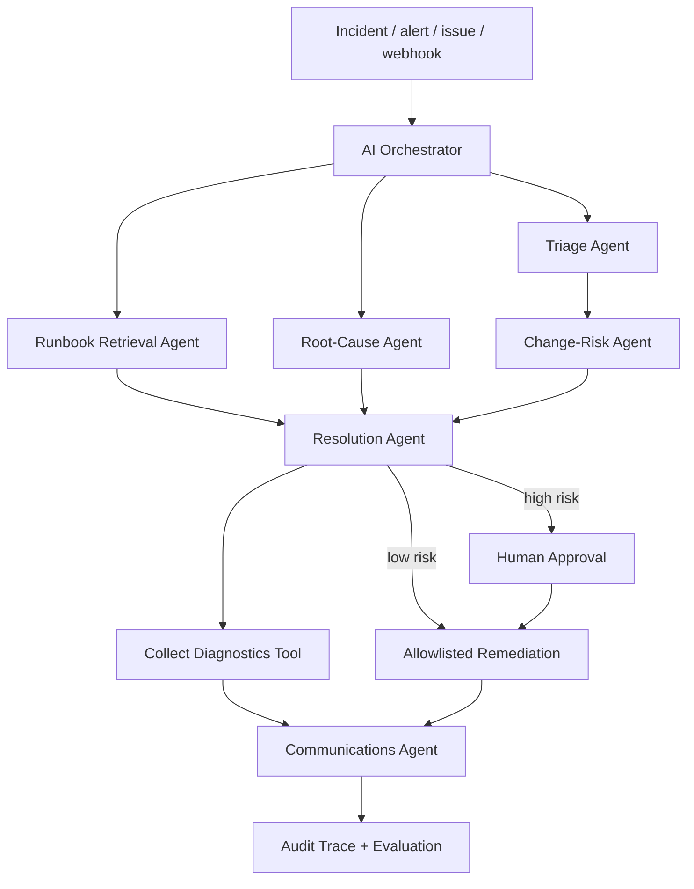

# AutonomousOps — AI Incident Governance & Service Recovery

**Event-driven incident response with deterministic risk controls, grounded runbook retrieval, human approval gates, simulated remediation, stakeholder communication, and auditable AgentOps.**

[](https://github.com/Samadritaacharya/autonomousops-incident-response-agent/actions/workflows/ci.yml)
[](https://github.com/Samadritaacharya/autonomousops-incident-response-agent/actions/workflows/frontend-ci.yml)
[](https://github.com/Samadritaacharya/autonomousops-incident-response-agent/actions/workflows/incident-agent-demo.yml)

> **Portfolio-safe by design:** all incidents are synthetic and every infrastructure mutation is simulated. The project demonstrates enterprise orchestration and governance without touching a real production system.

> **Control boundary at a glance:** severity, SLA, approval requirements, tool authorization, and remediation permission are deterministic. The optional LLM can enrich root-cause hypotheses only; it cannot approve or authorize a mutating action.

## Verification snapshot

| Proof point | Verified result |
|---|---:|
| Labeled synthetic evaluation cases | **24** |
| Severity classification | **24/24 — 100%** |
| Runbook selection | **24/24 — 100%** |
| Approval-gate policy | **24/24 — 100%** |
| Python unit/governance tests | **38/38 passed** |
| Command-center typecheck/tests/build/API smoke | **Passed in CI** |
| Required paid runtime services | **0** |

**What the 100% means:** the current implementation matches all expected labels in the 24 checked-in, hand-authored synthetic regression scenarios. It is **not** a claim of 100% production accuracy or statistical generalization. The evaluation is intentionally reproducible, inspectable, and designed to catch regressions.

## Command Center preview


*Vercel-rendered preview of the interactive command center. The UI exposes incident simulation, governance state, orchestration evidence, evaluation results, and the 3D/motion layer without requiring a model key or paid API.*

## Interactive Command Center

`frontend/` contains a **Next.js 16 / React 19** incident command center with:

- editable synthetic incident simulator
- deterministic P1–P4 triage and SLA targets
- grounded runbook retrieval
- root-cause hypotheses with deterministic fallback
- explicit approve/reject governance path
- complete per-agent evidence and tool trace
- React Three Fiber orchestration graph and motion layer
- browser-local run history
- `/api/health`, `/api/evaluation`, and `/api/incidents` route handlers

The hosted demo requires **no model key, database, login, analytics service, or paid API**. The TypeScript engine mirrors the public governance contract while the Python implementation remains the canonical full backend.

Run locally:

```bash
cd frontend
npm install
npm run dev
```

Vercel can deploy `frontend` as the Root Directory. See [`frontend/README.md`](frontend/README.md), [`frontend/DESIGN.md`](frontend/DESIGN.md), and [`docs/web-command-center.md`](docs/web-command-center.md).

## What is AI — and what is deliberately deterministic?

AutonomousOps does **not** let a probabilistic model self-authorize operational changes.

| Layer | Implementation | Why |
|---|---|---|
| Severity + SLA | Deterministic signals and policy | Stable, testable incident priority |
| Runbook retrieval | **Local TF-IDF cosine vector retrieval + service affinity** | Better matching without an external embedding API |
| Root-cause hypotheses | Optional generative model; deterministic fallback | Useful reasoning enrichment without making policy probabilistic |
| Approval decision | Deterministic policy | Auditable human-control boundary |
| Tool authorization | Allowlist + environment/approval checks | Prevents model output from becoming authority |
| Remediation | Simulated tools only | Safe portfolio demonstration |

The optional LLM can enrich **hypotheses only**. It cannot change severity, bypass approval, grant tool permission, or authorize a mutation.

For a concise interview-ready explanation of the metrics, trade-offs, limitations, and productionization path, see [`docs/interview-guide.md`](docs/interview-guide.md).

## Verified end-to-end event proof

The system has been exercised through a real GitHub event path rather than only through local function calls:

1. A synthetic `[INCIDENT]` GitHub issue triggers GitHub Actions.
2. The orchestrator classifies severity, retrieves a runbook, collects diagnostics, and evaluates change risk.
3. A high-risk incident pauses at the approval gate.
4. Only an authorized repository `OWNER`, `MEMBER`, or `COLLABORATOR` can resume the GitHub workflow with `/approve`; `/reject` stops remediation.
5. The allowlisted remediation simulation executes and the workflow posts the final stakeholder/audit response.

**Proof run:** [Issue #1 — Checkout API timeouts after deployment](https://github.com/Samadritaacharya/autonomousops-incident-response-agent/issues/1)

## Why I built this

Many AI portfolios stop at chatbots or dashboards. AutonomousOps demonstrates an enterprise operating pattern where an **event** starts the workflow, specialist components build context, knowledge grounds the proposed action, deterministic policy controls risk, humans approve high-impact actions, tools execute only allowlisted simulations, stakeholders receive updates, and the complete run is auditable.

This maps directly to the operating concerns behind AI transformation, service management, PMO/governance, and autonomous-agent adoption: **control, traceability, escalation, approval, evidence, and measurable evaluation**.

## Architecture



## What is working

| Capability | Implementation |
|---|---|
| Interactive command center | Next.js 16 + React 19 |
| 3D / motion layer | React Three Fiber + ShaderGradient + Motion |
| Zero-key hosted demo backend | Next.js route handlers + deterministic TypeScript contract |
| Event-driven trigger | GitHub Issues → GitHub Actions |
| Python demo UI | Streamlit |
| Machine-to-machine API | FastAPI |
| Triage | Severity + SLA classification with negation-aware signal handling |
| Runbook grounding | Local TF-IDF cosine vector retrieval + deterministic service affinity |
| Root-cause reasoning | Optional LLM + deterministic fallback, bounded to three hypotheses |
| Risk governance | Deterministic approval policy |
| Resolution | Grounded allowlisted action selection |
| Tool execution | Diagnostics + portfolio-safe remediation simulation |
| Human-in-the-loop | Web, Streamlit/API, and GitHub `/approve` / `/reject` flows |
| Communications | Stakeholder-ready incident update |
| AgentOps | Trace IDs, per-agent evidence, JSONL audit log |
| Evaluation | 24 labeled synthetic cases + Python/TypeScript parity checks |
| CI | Python compile/tests/eval/UI/API/Docker + web typecheck/tests/build/HTTP smoke |
| Containerization | Docker + docker-compose |
| Enterprise mapping | Microsoft Copilot Studio implementation blueprint |

## Specialist workflow

1. **Triage Agent** — classifies P1–P4 urgency and SLA target.
2. **Runbook Retrieval Agent** — ranks repository runbooks in a local TF-IDF vector space, with deterministic service affinity when the service is known.
3. **Root-Cause Agent** — generates bounded hypotheses from incident and runbook context.
4. **Change-Risk Agent** — owns the deterministic approval boundary.
5. **Resolution Agent** — selects an allowlisted candidate action from grounded steps.
6. **Tool Executor** — runs diagnostics and safe remediation simulations.
7. **Communications Agent** — produces stakeholder updates.
8. **Orchestrator** — sequences the workflow and preserves the trace.

## Evaluation and parity

The Python evaluator reads `data/sample_incidents.csv`; the web command center evaluates the same 24 scenarios from a checked-in JSON mirror. A dedicated parity test fails CI if the two sets drift.

The dataset includes known and unknown services, API latency, queue backlog, database failures, generic low-risk incidents, staging/production differences, recent-change governance, and negated language such as **“no outage”** and **“no errors.”**

Run the Python evaluation:

```bash
python -m pytest -q
python scripts/evaluate.py
```

Run the command-center checks:

```bash
cd frontend
npm run typecheck
npm test
npm run build
```

Current CI-verified synthetic baseline:

```text
cases:                  24
severity_accuracy:      1.00
runbook_accuracy:       1.00
approval_gate_accuracy: 1.00
```

These metrics describe this repository's labeled synthetic test set only. They should not be presented as production incident-resolution rates.

## Python quick start

```bash
python -m venv .venv
# Windows
.venv\Scripts\activate
# macOS/Linux
source .venv/bin/activate

pip install -r requirements.txt
streamlit run app.py
```

### Optional generative reasoning

The repository works with no model credentials. To enable the optional Root-Cause Agent LLM layer:

```bash
cp .env.example .env
# add OPENAI_API_KEY to .env
```

If the model is disabled or unavailable, the deterministic fallback remains active. Severity, approvals, and tool permissions are deterministic in both modes.

## API

```bash
uvicorn api:app --reload
```

Health check:

```bash
curl http://127.0.0.1:8000/health
```

Synthetic incident:

```bash
curl -X POST "http://127.0.0.1:8000/v1/incidents" \
  -H "Content-Type: application/json" \
  -d '{
    "incident_id":"INC-API-1",
    "title":"Checkout API timeouts",
    "description":"Production checkout requests are timing out after a deployment",
    "service":"checkout-api",
    "environment":"production",
    "customer_impact":"Multiple customers cannot complete checkout",
    "recent_change":true
  }'
```

## Docker

```bash
cp .env.example .env
docker compose up --build
```

- Streamlit: `http://localhost:8501`
- FastAPI: `http://localhost:8000`
- API docs: `http://localhost:8000/docs`

## Autonomous GitHub demo

1. Open **Issues → New issue**.
2. Choose **AutonomousOps incident demo**.
3. Submit a synthetic incident.
4. GitHub Actions runs the orchestration workflow.
5. The agent posts severity, runbook, hypotheses, evidence, tool trace, governance state, and stakeholder update.
6. If the workflow pauses, an authorized repository owner/member/collaborator comments `/approve` to resume or `/reject` to stop.

No separate `incident` label is required.

## Repository structure

```text
.
├── frontend/                       # Next.js interactive command center
│   ├── app/                        # UI + route handlers
│   ├── components/                 # motion, 3D graph, simulator
│   ├── lib/                        # deterministic web agent + evaluation fixtures
│   ├── tests/                      # web governance and parity tests
│   ├── DESIGN.md
│   └── README.md
├── app.py                          # Streamlit demo experience
├── api.py                          # FastAPI endpoint
├── src/
│   ├── agents.py                   # triage, vector retrieval, reasoning, risk, resolution
│   ├── evaluator.py                # measured evaluation
│   ├── llm.py                      # optional generative reasoning
│   ├── models.py                   # incident/trace models
│   ├── orchestrator.py             # workflow sequencing
│   └── tools.py                    # governed tool layer
├── scripts/
│   ├── evaluate.py
│   ├── simulate_incident.py
│   └── github_issue_agent.py
├── knowledge/runbooks/
├── data/sample_incidents.csv       # 24-case labeled synthetic evaluation set
├── docs/
│   ├── assets/command-center-preview.jpg
│   └── interview-guide.md
├── tests/
├── .github/
├── Dockerfile
├── docker-compose.yml
├── SECURITY.md
└── LICENSE
```

## Microsoft Copilot Studio enterprise mapping

[`docs/copilot-studio-implementation.md`](docs/copilot-studio-implementation.md) maps the public implementation to:

- agent instructions and generative orchestration
- grounded knowledge
- tools, connectors, and agent flows
- autonomous event triggers
- approval workflows
- Teams/Outlook-style communications
- evaluation and monitoring

The public Python/GitHub implementation makes the architecture inspectable; the Microsoft blueprint shows how the same governance pattern can move into an enterprise agent platform.

## Scope and safety

This repository is a **new portfolio project built with synthetic data**. It demonstrates architecture, governance, evaluation, and implementation quality; it does not claim real production usage, outage reduction, cost savings, or customer impact.

Read [SECURITY.md](SECURITY.md). Do not connect this portfolio implementation to real production systems without organization-specific identity, secrets management, DLP, change-management, approval, observability, and operational controls.
