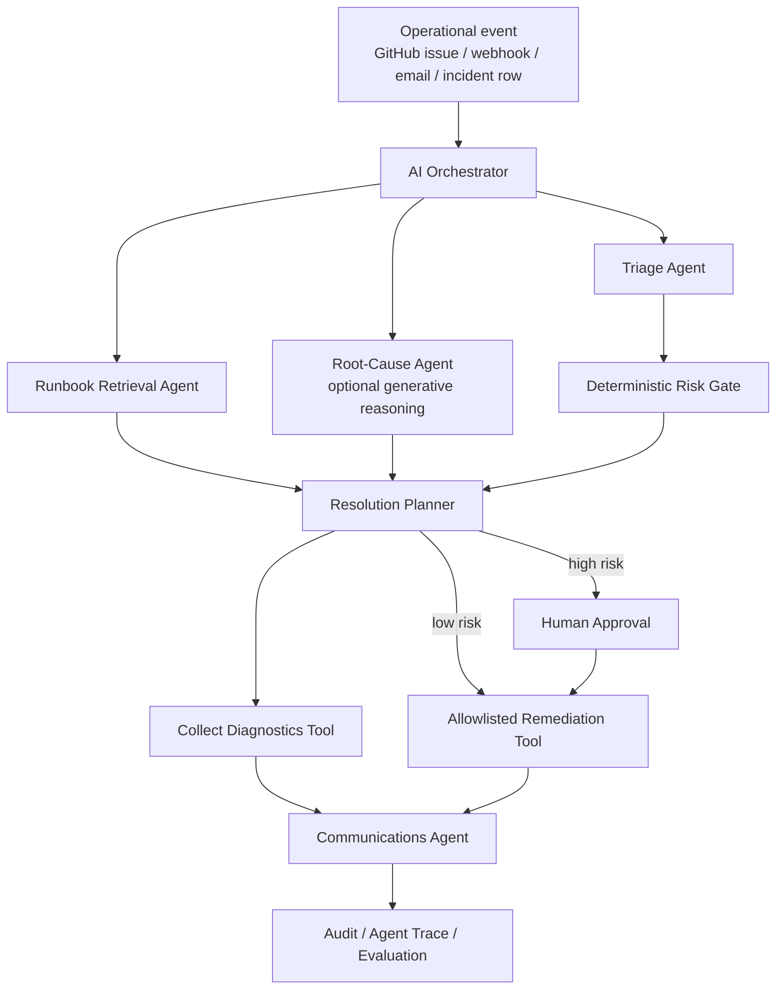

# AutonomousOps architecture

## System view

## Responsibility boundaries

| Component | Responsibility | Allowed to authorize mutation? |
|---|---|---:|
| Triage Agent | Classify urgency and SLA | No |
| Runbook Agent | Ground the workflow in operating procedures | No |
| Root-Cause Agent | Produce bounded hypotheses | No |
| Change-Risk Agent | Determine whether approval is mandatory | **Yes — policy only** |
| Resolution Agent | Select an allowlisted candidate action | No |
| Tool Registry | Execute/simulate tools only when policy permits | Enforces policy |
| Communications Agent | Generate stakeholder update | No |
| Orchestrator | Sequence agents and preserve trace | No independent bypass |

## Why the generative model cannot bypass governance

The optional LLM is deliberately outside the authorization boundary. It can enrich hypotheses, but severity, approval requirements and tool execution are deterministic. This separation is important for enterprise agentic systems: probabilistic reasoning helps with interpretation and planning, while explicit policy owns high-impact permissions.

## Event paths

### GitHub recruiter demo

1. A user creates an issue from the **AutonomousOps incident demo** template.
2. The title begins with `[INCIDENT]`.
3. GitHub Actions receives the issue event.
4. `scripts/github_issue_agent.py` normalizes the issue form into an `Incident` object.
5. The orchestrator runs every specialist agent.
6. The workflow posts severity, runbook, hypotheses, tool trace, governance evidence and stakeholder communication back to the issue.

### HTTP/API demo

`POST /v1/incidents` on the FastAPI service accepts a structured incident event and returns the complete orchestration result. Add `?approved=true` to demonstrate resuming an approval-gated workflow in the safe simulation.

### Streamlit recruiter demo

The Streamlit UI lets a recruiter inject an event, inspect the full multi-agent trace, approve a gated remediation and run the measured evaluation dataset.

## Production translation

A production-grade implementation would replace the simulated tools with organization-approved connectors or APIs while preserving the same boundary:

- ServiceNow/Jira/Azure DevOps for incident and change records
- Azure Monitor / Datadog / Splunk / Dynatrace for diagnostics
- Microsoft Teams / Outlook for communications
- Power Automate / Copilot Studio agent flows for tools and approvals
- Dataverse / SharePoint for incident context, policy and runbooks
- audited secrets/managed identities and environment-specific allowlists

The public repository intentionally stops before real infrastructure mutation.
